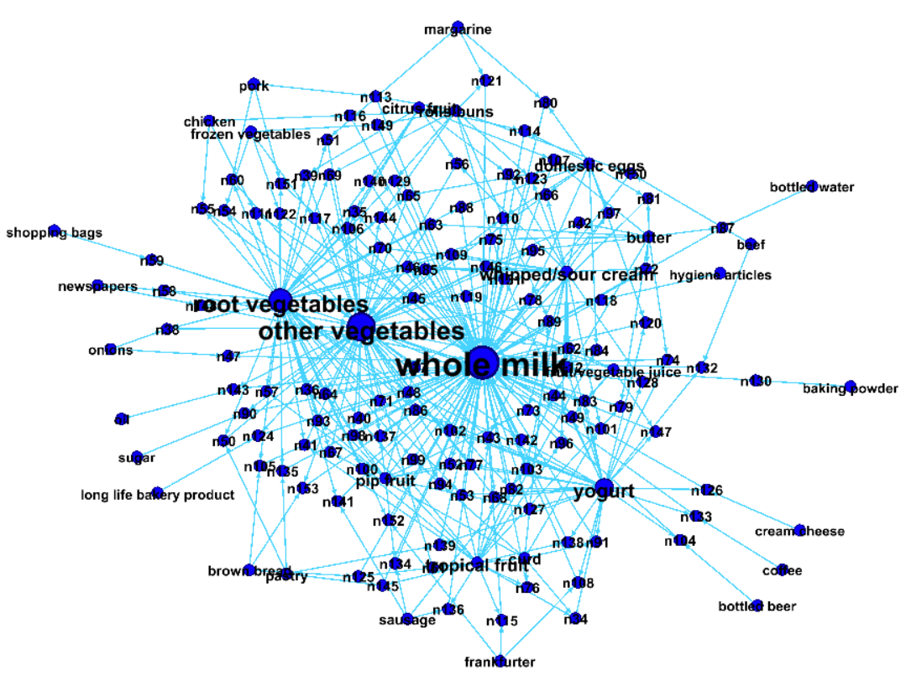

```{r setup, include=FALSE}
knitr::opts_chunk$set(echo = TRUE)
```


#Flights at ABIA

```{r Read Data, echo=FALSE, message= FALSE}
library(data.table)
library(reshape2)
require(reshape)
library(reshape)
library(ggplot2)
library(ggmap)
library(lubridate)
library(doBy)
library(geosphere)
library(kableExtra)

data = read.csv('C:/Users/Abraham/Documents/UT/MSBA/Intro Predictive Modeling/HW2/ABIA.csv')
```

```{r Filter Data, echo=FALSE}
#Remove flight number and tail number
df = data[,-c(10,11)]   

#Create date column
df$date = as.Date(with(df,paste(Year,Month,DayofMonth,sep='-')), '%Y-%m-%d')
df$week = strftime(df$date,format='%V')
#Y variables: Delays, Cancellations, Diverted, The other airport
#X variables: Departure and Arrival Time of day,  Day of the week, Day/Month for seasonal, The other airport, Airline, 

```

###Best Time of Day

For all of the below analysis on delayed flights, we have standardized the number of delayed flights with the total number of flights in the given time period, and only considered delays longer than 20 minutes. We did not want to include a large number of trivial delays of only a few minutes. We also separated flights departing from those arriving in Austin with the hope of isolating delays happening at ABIA from those all around the country. When looking at time of day, delays esspecially for arrivals increases towards the end of the day because of the effects from delays in previous connecting flights that day. Interestingly, departure delays spike at 11 AM, which might be caused by heavy air traffic as many people don't want to fly early in the morning.

```{r Time of Day, warnings=FALSE, echo=FALSE}
#Convert to time
df$CRSDepTime = sprintf("%04d", df$CRSDepTime)
df$CRSDepTime = format(strptime(df$CRSDepTime, format="%H%M"), format = "%H:00")
df$CRSArrTime = sprintf("%04d", df$CRSArrTime)
df$CRSArrTime = format(strptime(df$CRSArrTime, format="%H%M"), format = "%H:00")

#Departure and Arrival Delays
delayed = df[df$DepDelay>20,]   #departure delays
delayed = delayed[delayed$Origin=='AUS',]
delayed.A = df[df$ArrDelay>20,]   #arrival delays
delayed.A = delayed.A[delayed.A$Origin!='AUS',]

#Departures by hour
delayhours = table(delayed$CRSDepTime)
flightcounts = table(df[df$Origin=='AUS',]$CRSDepTime)
delayhours = as.matrix(rbind(delayhours,flightcounts))
delayhours[1,] = delayhours[1,]/delayhours[2,]

#Arrivals by hour
delayhours.A = table(delayed.A$CRSDepTime)
flightcounts.A = table(df[df$Origin!='AUS',]$CRSDepTime)
delayhours.A = as.matrix(rbind(delayhours.A,flightcounts.A))
delayhours.A[1,] = delayhours.A[1,]/delayhours.A[2,]

#Combine and plot
hourmatrix = matrix(0,nrow=2,ncol=19)
rownames(hourmatrix) = c('Departures', 'Arrivals')
colnames(hourmatrix) = colnames(delayhours)
hourmatrix[1,] = delayhours[1,]
hourmatrix[2,] = delayhours.A[1,]

barplot(hourmatrix, col = c(rgb(0,0,1,3/4), rgb(1,1/2,0)),main='Percent Delayed (20+ min)', beside=TRUE, args.legend = list(x = "topright", bty = "y") ,legend.text = rownames(hourmatrix), xlab='Time of Day')

```

###Best Day of the Week

A similar analysis was run below for delayed flights by aggregating across the day of the week. The delay frequencies seem to follow busy times of air travel (Friday and Sunday/Monday). While people commonly avoid flying on weekends in general, Saturday actually shows the lowest percentage of delayed flights while Thursday has an unexpectedly high number of delays. Again, arrival delays are consistently more common than departures because they have a much larger number of influencing factors in airports around the country.  

```{r Day of the Week, echo=FALSE}
#Departures
delaycounts = table(delayed$DayOfWeek)
flightcounts = table(df[df$Origin=='AUS',]$DayOfWeek)
delaycounts = as.matrix(rbind(delaycounts,flightcounts))
delaycounts[1,] = delaycounts[1,]/delaycounts[2,]

#Arrivals
delaycounts.A = table(delayed.A$DayOfWeek)
flightcounts.A = table(df[df$Origin!='AUS',]$DayOfWeek)
delaycounts.A = as.matrix(rbind(delaycounts.A,flightcounts.A))
delaycounts.A[1,] = delaycounts.A[1,]/delaycounts.A[2,]

#Combine and plot
delaymatrix = matrix(0,nrow=2,ncol=7)
rownames(delaymatrix) = c('Departures', 'Arrivals')
colnames(delaymatrix) = c('Mon', 'Tue','Wed','Thur','Fri','Sat', 'Sun')
delaymatrix[1,] = delaycounts[1,]
delaymatrix[2,] = delaycounts.A[1,]

barplot(delaymatrix, col = c(rgb(0,0,1,3/4), rgb(1,1/2,0)),main='Percent Delayed (20+ min)', beside=TRUE, args.legend = list(x = "bottomright", bty = "y") ,legend.text = rownames(delaymatrix))

```

###Best Time of Year

Now looking at a weekly scale, we can see seasonal and event-driven fluctuations in flight delays such as during the holidays, summer vacations, and SXSW. An important observation to note that we have seen in some form above, is that departure delays follow arrival delay patterns almost exaclty, just to a lesser degree. If we assume a majority of delayed departures from ABIA are caused by delayed arrivals, the consistent difference between them can be interpreted as the arrival delays that were compensated for at ABIA. The fall season has significantly less delayed flights, likely to lower traffic in general. Here we can see the gap between arrivals and departures approach zero as the delay frequency approaches 5%. This may be the actual amount of departures that were delayed due to issues at ABIA.

```{r Time of Year, echo=FALSE}
#Departures
delayweek = table(delayed$week)
flightcounts = table(df[df$Origin=='AUS',]$week)
delayweek = as.matrix(rbind(delayweek,flightcounts))
delayweek[1,] = delayweek[1,]/delayweek[2,]

#Arrivals
delayweek.A = table(delayed.A$week)
flightcounts.A = table(df[df$Origin!='AUS',]$week)
delayweek.A = as.matrix(rbind(delayweek.A,flightcounts.A))
delayweek.A[1,] = delayweek.A[1,]/delayweek.A[2,]

#Combine and plot
weeklymatrix = matrix(0,nrow=2,ncol=52)
rownames(weeklymatrix) = c('Departures', 'Arrivals')
colnames(weeklymatrix) = c(1:52)
weeklymatrix[1,] = delayweek[1,]
weeklymatrix[2,] = delayweek.A[1,]

weekstarts = unique(floor_date(delayed$date, unit="week"))
weekstarts = weekstarts[-c(1,2)]
colnames(weeklymatrix) = as.character(weekstarts)
plot(weeklymatrix[1,], col = 'blue', main='Percent Delayed (20+ min)', type='l' ,lwd=3, ylab='% Flights Delayed', xlab='', xaxt='n', ylim=c(0,.3))
lines(weeklymatrix[2,],col= 'orange', lwd=3 )
axis(1, at=1:52, labels=weekstarts)
legend('bottom',legend=c('Arrivals','Departures'), fill=c('orange','blue'))
```

###Best Locations

Aggregating flights over the entire year, we can see the best and worst airports in terms of flight delays to and from Austin. A majority of the most delayed destinations are in the north of the country, which sees a much higher rate of delays simply due to weather. As expected the largest airports including JFK, Newark, and O'hare also show the most flight delays going both ways. The exception to this is LAX, which shows a surpsingly low rate of delays (under 10% overall). Other than LAX, the least delayed airports are generally smaller than average.


```{r Airports, echo=FALSE}
#Departures
delayport = table(delayed$Dest)
flightcounts = table(df[df$Origin=='AUS',]$Dest)
delayport = as.matrix(rbind(delayport,flightcounts))
delayport[1,] = delayport[1,]/delayport[2,]
delayport = delayport[,-3]

#Arrivals
delayport.A = table(delayed.A$Origin)
flightcounts.A = table(df[df$Origin!='AUS',]$Origin)
delayport.A = as.matrix(rbind(delayport.A,flightcounts.A))
delayport.A[1,] = delayport.A[1,]/delayport.A[2,]
delayport.A = delayport.A[,-3]

#Combine and plot
portlist = intersect(colnames(delayport), colnames(delayport.A))
portmatrix = matrix(0,nrow=2,ncol=length(portlist))
rownames(portmatrix) = c('Departures', 'Arrivals')
colnames(portmatrix) = portlist
portmatrix[1,] = delayport[1,portlist]
portmatrix[2,] = delayport.A[1,portlist]

par(mfrow=c(2,2))
barplot(sort(portmatrix[1,])[39:49], main='Most Delayed Destinations', col=rgb(0,0,1,1), ylab='% Delayed (20+ min)', ylim=c(0,.4), las=2)
barplot(sort(portmatrix[1,])[1:10], main='Least Delayed Destinations',col=rgb(0,0,1,1/2), ylab='% Delayed (20+ min)', ylim=c(0,.4), las=2)
barplot(sort(portmatrix[2,])[39:49], main='Most Delayed Arrivals',col=rgb(1,1/2,0,1), ylab='% Delayed (20+ min)', ylim=c(0,.4), las=2)
barplot(sort(portmatrix[2,])[1:10], main='Least Delayed Arrivals',col=rgb(1,1/2,0,1/2), ylab='% Delayed (20+ min)', ylim=c(0,.4), las=2)

```

###Traffic

The histogram below shows the frequency of flights based on their flight times. The majority of flights to and from Austin are less than one hour, most of which go through Houston and Dallas. The next peak in number of flights is in the 2.5 hour range and major airports within this range include Pheonix, Denver, and Chicago. The far right tail includes the longest flights to areas in the US such as Seattle and Boston. These inferences are supported by the map below, which shows the number of flights departing Austin by airport. The map for flights arriving in Austin is virtually identical.

```{r Maps, warning=FALSE,message=FALSE, echo=FALSE}
ap = read.csv('C:/Users/Abraham/Documents/UT/MSBA/Intro Predictive Modeling/HW2/Airports.csv')

ports = ap[ap$type=='large_airport',c('iata_code','latitude_deg','longitude_deg')]

dforigin = merge(df, ports, by.x='Origin', by.y='iata_code')
dfdest = merge(df, ports, by.x='Dest', by.y='iata_code')

dfomap = summaryBy(dforigin~Origin+longitude_deg+latitude_deg, data=dforigin,FUN=length)
dfomap = dfomap[dfomap$Origin!='AUS',]
dfdmap = summaryBy(dfdest~Dest+longitude_deg+latitude_deg, data=dfdest,FUN=length)
dfdmap = dfdmap[dfdmap$Dest!='AUS',]

us <- c(left = -125, bottom = 25.75, right = -67, top = 49)
map <- get_stamenmap(us, zoom = 5, maptype = "toner-lite")

hist(df$ActualElapsedTime, breaks=35, xaxp  = c(0, 360, 6), xlim=c(0,360), main='Flight Times', xlab='Elapsed Time (min)', col = rgb(0,0,1,3/4))

ggmap(map) + geom_point(aes(x = longitude_deg, y = latitude_deg, size = Dest.length), data = dfdmap, color='blue', alpha=0.5)  + 
  theme(legend.title=element_blank()) +
  ggtitle("Number of Departing Flights") +xlab("") + ylab("") 
```


#Author Attribution

```{r, echo=FALSE, message=FALSE, warning=FALSE}
library(tm)
library(tm) 
library(magrittr)
library(slam)
library(proxy)
#Wrapper function
readerPlain = function(fname){
  readPlain(elem=list(content=readLines(fname)), 
  id=fname, language='en') }


train_folders = Sys.glob('C:/Users/Abraham/Desktop/ReutersC50/C50train/*')
test_folders = Sys.glob('C:/Users/Abraham/Desktop/ReutersC50/C50test/*')
```

```{r Authors,echo=FALSE}
#Get the files from each author folder, fill file_list_train
file_list_train = NULL
names_list = NULL
for(author in train_folders) 
{
author_name = substring(author, first = 29)
files_to_add = Sys.glob(paste0(author, '/*.txt'))
file_list_train = append(file_list_train, files_to_add)
names_list = append(names_list, rep(author_name, length(files_to_add)))
}
#file_list_train name cleaning
train_documents = lapply(file_list_train, readerPlain) 
names(train_documents) = file_list_train
names(train_documents) = sub('.txt', '', names(train_documents))
```

```{r Corpus, echo=FALSE, message=FALSE, warning=FALSE}
#Turn file_list_train into Corpus
train_corpus = Corpus(VectorSource(train_documents))

# Preprocessing
train_corpus = tm_map(train_corpus, content_transformer(tolower))
train_corpus = tm_map(train_corpus, content_transformer(removeNumbers))
train_corpus = tm_map(train_corpus, content_transformer(removePunctuation))
train_corpus = tm_map(train_corpus, content_transformer(stripWhitespace)) 
train_corpus = tm_map(train_corpus, content_transformer(removeWords), stopwords("SMART"))
train_corpus = tm_map(train_corpus, content_transformer(removeWords), stopwords("en"))
```

```{r DTM, echo=FALSE}
#Create Document Term Matrix
DTM_train= DocumentTermMatrix(train_corpus)
DTM_train = removeSparseTerms(DTM_train, 0.95)
# DTM_train 
# inspect(DTM_train[1:10,1:10])
```

```{r TFIDF, echo=FALSE}
#Create TF-IDF Weights
tfidf_train = weightTfIdf(DTM_train)
```

```{r Test Authors, echo=FALSE}

# Same Process for Test Data:
# Get all files into a list: file_list_test
file_list_test = NULL
names_list = NULL
for(author in test_folders) 
{
author_name = substring(author, first = 28)
files_to_add = Sys.glob(paste0(author, '/*.txt'))
file_list_test = append(file_list_test, files_to_add)
names_list = append(names_list, rep(author_name, length(files_to_add)))
}
#file_list_train name cleaning
test_documents = lapply(file_list_test, readerPlain) 
names(test_documents) = file_list_test
names(test_documents) = sub('.txt', '', names(test_documents))
```

```{r Test Corpus, echo=FALSE, message=FALSE, warning=FALSE}
#Turn file_list_test into Corpus
test_corpus = Corpus(VectorSource(test_documents))
```

```{r Preprocessing, echo=FALSE, message=FALSE, warning=FALSE}
# Preprocessing
test_corpus = tm_map(test_corpus, content_transformer(tolower))
test_corpus = tm_map(test_corpus, content_transformer(removeNumbers))
test_corpus = tm_map(test_corpus, content_transformer(removePunctuation)) 
test_corpus = tm_map(test_corpus, content_transformer(stripWhitespace))
test_corpus = tm_map(test_corpus, content_transformer(removeWords), stopwords("SMART"))
test_corpus = tm_map(test_corpus, content_transformer(removeWords), stopwords("en"))
```

```{r Test DTM, echo=FALSE}
#Create Document Term Matrix
DTM_test= DocumentTermMatrix(test_corpus,control = list(dictionary=Terms(DTM_train)))
# DTM_test
# inspect(DTM_test[1:10,1:10])
```

```{r Test TFIDF, echo=FALSE, message=FALSE, warning=FALSE}
#Create TF-IDF Weights
tfidf_test = weightTfIdf(DTM_test)
```

###PCA

After pre-proccessing all authors in the train and test set, we ran a principal component analysis and the variance explained is shown in the graph below. The main classifications shown in the first principal components seem to primarily distinguish between articles about China and articles about global economics and finance. For example, the first PC has strong positive coefficents for the words China, Hong Kong, Chinese, and Communist, and has negative coefficients for words such as computer, software, quarter, bank, funds, etc. The next two components are similar, but there is variation in the focus on either economics or politics.


```{r PCA, echo=FALSE, warning=FALSE, message=FALSE}
# PCA 
tfidf_train_matrix <- as.data.frame(as.matrix(tfidf_train))
tfidf_test_matrix <- as.data.frame(as.matrix(tfidf_test))

# dim(tfidf_train_matrix) 
tfidf_train_matrix= tfidf_train_matrix[ , apply(tfidf_train_matrix, 2, var) != 0]
#Predict 
pc_author = prcomp(tfidf_train_matrix)
pc_author_test = predict(pc_author, newdata = tfidf_test_matrix)

#Plot variance explained
pve = summary(pc_author)$importance[3,]
plot(pve)
```

###Boosting

Individual words are weak classifiers becauese they are relatively infrequent across so many documents. Since boosting combines weak classifiers into stronger ones, we thought this approach would best for connecting sets of words to authors. Accuracy on the training documents was high at 85.6%, but test accuracy dropped to 39%. 

```{r Boosting, echo=FALSE, message=FALSE, warning=FALSE}
#Boosting 
library(gbm)
set.seed(100)

cuts = 75
X = pc_author$x[,1:cuts]
y = sapply(strsplit(names(train_documents), "/"), "[", 7)
X_test = pc_author_test[,1:cuts]
y_test = sapply(strsplit(names(test_documents), "/"), "[", 7)

TrainSet <- cbind(as.data.frame(X),y)
ValidSet <- cbind(as.data.frame(X_test),y_test)

boost.author <- gbm(y ~.,data=TrainSet, n.trees =100 ,shrinkage = 0.01,distribution = "multinomial",interaction.depth=4, cv.folds = 5)
# summary(boost.author)

#Formatting
boostacc = matrix(0,nrow=1,ncol=2)
rownames(boostacc)='Accuracy'
colnames(boostacc)=c('Training', 'Test')

# Training Accuracy
pred=as.data.frame(predict(boost.author,newdata =TrainSet,n.trees=100,type="response"))
pred_val = sub("*\\.[0-9]+", "", colnames(pred)[apply(pred,1,which.max)])
boostacc[1,1]=mean(pred_val== y )

# Test Accuracy
pred=as.data.frame(predict(boost.author,newdata =ValidSet,n.trees=100,type="response"))
pred_val = sub("*\\.[0-9]+", "", colnames(pred)[apply(pred,1,which.max)])
boostacc[1,2]=mean(pred_val== y )

kable(boostacc) 

```


<br>

###Random Forest


Random Forset is a generally strong model for classification, and we wanted to use this as a baseline to compare to Boosting. With 250 trees, the test accuracy equalled 50%, which is substantially higher than that of the boosting model. However there is large variability in the accury of predicting individual authors, which can be seen in the table of error rates below. For example, the model accuracy was over 90% when the author of a document was Aaron Pressman, but less than 30% for Scott Hillis. This is because 30 out of 50 times, the model predicted Scott's articles to be written by Samuel Perry. This is one example of two others having similar word frequencies, making it hard to distinguish between their works using just a bag of words.


```{r Random Forest, echo=FALSE, message=FALSE, warning=FALSE}
#Random Forest

library(randomForest)
set.seed(100)
cuts = 150
X = pc_author$x[,1:cuts]
y = sapply(strsplit(names(train_documents), "/"), "[", 7)
X_test = pc_author_test[,1:cuts]
y_test = sapply(strsplit(names(test_documents), "/"), "[", 7)

TrainSet <- cbind(as.data.frame(X),y)
ValidSet <- cbind(as.data.frame(X_test),y_test)

rffit <- randomForest(y~.,TrainSet,ntree=250)

errormatrix = matrix(0,nrow=1,ncol=1)
rownames(errormatrix) = 'RF Test Accuracy'
# predict(rffit,ValidSet)== y
errormatrix[1,1] = mean(predict(rffit,ValidSet)== y )
kable(errormatrix)


kable(as.matrix(rffit$confusion[,51]))

```


<br>

#Association Rules

```{r, echo=FALSE, warning=FALSE, message=FALSE}
library(tidyverse)
library(arules)
library(arulesViz)
```

The plot below shows the overall prior frequencies of items in our dataset of transactions. Whole milk is the most frequenly purchased by a considerable margin, followed by vegetables, rolls/buns, soda, and so on. Before looking for associations, we know that many of these items will have to be frequently purchased together, so we would want a significant confidence in any rules we find in predicting these items.

```{r, echo=FALSE}
## 1c. Cast this variable as a special arules "transactions" class
groceries = read.transactions(file='C:/Users/Abraham/Documents/UT/MSBA/Intro Predictive Modeling/HW2/groceries.txt',
                               format='basket',sep = ',', rm.duplicates = TRUE, )

# View(groceries)
# str(groceries)
# summary(groceries)
# Each row is a basket/transation; we have 8935 baskets (rows) and 169 items (columns)

## Visualization: barplot of top 20 items and frequency 
itemFrequencyPlot(groceries,topN=20,type="absolute",col=cm.colors(22),main='Frequency of Item Purchased')
```

After trying different combinations, we decided on a support metric of 0.005 and confidence of 0.5 when creating our association rules. We also limited the length of the item list in the each rule to five items. The confidence was the most important factor to consider, given the high frequency of some of the items discussed before. A confidence of 0.5 means that all rules follow the format of "Given this item list there is at least a 50% chance of the person also buying X." These parameters yielded a set of 120 assocation rules shown below. The highest confidence rules have a lift of between 2 and 3 times above the prior probabilities. There is also a large numbers of rules at this level of lift with a confidence barely above 50%. However, we felt that 120 assocation rules provides a reasonable amount of predictive itemsets and predicted items. Also, the highest lift rules all have relatively low support as expected because the most informative rules should be less common.


```{r, echo=FALSE, warning=FALSE, message=FALSE, results='hide'}
## 2. Running the 'apriori' algorithm 
grules = apriori(groceries, 
                 parameter=list(support=.005, confidence=.5, maxlen=5))
# absolute minimum support count: 49
# summary(grules)

# 873 rules (support > .005 & confidence >.1 & length (# items) <= 5; parameters from playlists.R)
# 22 rules (support > .005 & confidence >.6 & length (# items) <= 5
### 120 rules (support > .005 & confidence >.5 & length (# items) <= 5
# 15 rules (support > .01 & confidence >.5 & length (# items) <= 5
# 5622 rules (support > .001 & confidence >.5 & length (# items) <= 5

# inspect(grules)

#### BELOW PARAMETERS WILL CHANGE BASED ON WHAT WE CHOOSE FOR SUPPORT AND CONFIDENCE ###

## 2a. Choose a subset (???)
# inspect(subset(grules, subset=lift > 2.3)) # mean of lift, 55 rules
# inspect(subset(grules, subset=confidence > 0.6)) # 22 rules
# inspect(subset(grules, subset=lift > 2.3 & confidence > 0.6)) #22 rules

# 3. plot all the rules in (support, confidence) space
# plot(grules)
```

```{r, echo=FALSE}
# 3a. can swap the axes and color scales
plot(grules, measure = c("support", "lift"), shading = "confidence")
```

The rules shown below have the highest support and confidence, respectively, and they all contain Whole Milk on the right hand side of the rule. While we know whole milk is already the most commonly purchased product, the lift on all of these rules is above 2, meaning that the conditional probability of a person getting whole milk is double that of the probability before they have any other items.


```{r, echo=FALSE, warning=FALSE, message=FALSE}
# 3b. "two key" plot: coloring is by size (order) of item set
# plot(grules, method='two-key plot')

# 3c. can now look at subsets driven by the plot
subrules1 = subset(grules, support > 0.015)
df_subset1 = data.table( lhs = labels( lhs(subrules1) ), 
                        rhs = labels( rhs(subrules1) ), 
                        quality(subrules1) )[ order(-lift), ]
kable(df_subset1) %>%
  kable_styling(bootstrap_options = c("striped", "hover")) #Most points < 0.015, 2 rules

subrules2 = subset(grules, confidence > 0.65)
df_subset2 = data.table( lhs = labels( lhs(subrules2) ), 
                        rhs = labels( rhs(subrules2) ), 
                        quality(subrules2) )[ order(-lift), ]
kable(df_subset2) %>%
  kable_styling(bootstrap_options = c("striped", "hover")) #Most poins < 0.65, 3 rules
```

A network graph of our 120 association rules using a ForceAtlas 2 layout in Gephi is shown below. Whole milk, root vegetables, other vegetables, and yogurt appear as the most frequently predicted items from our rules. However, they are not all necessarily the most purchased products overall. Rolls and Soda do not appear significant in associations, even though they are relatively common in item baskets. Whole milk is again the most predicted item by far, and a grocery store can leverage this since it is already the most commonly purchased item by promoting deals with known associated products such as root vegetables and yogurt (seen above).

```{r, echo=FALSE}
# 4. graph-based visualization
sub1 = subset(grules, subset=confidence > 0.01 & support > 0.005)
# summary(sub1)
# plot(sub1, method='graph') # graph for 100 rules
# 
# # 4a. graph for 100 rules 
# plot(head(sub1, 100, by='lift'), method='graph') 

# 4b. export
# saveAsGraph(head(sub1, n = 1000, by = "lift"), file = "grules.graphml")

```




